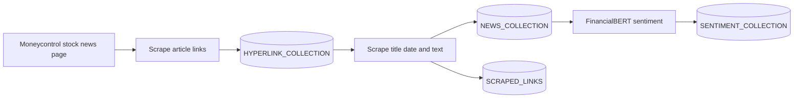

# Moneycontrol News Intelligence

A Selenium and MongoDB pipeline for collecting Moneycontrol business news and assigning financial sentiment to each article with FinBERT.

> **Important:** This project depends on Moneycontrol's current HTML structure and a local MongoDB instance. It is intended for research and personal analysis. Review the website's terms, robots guidance, and applicable law before scraping.

## Pipeline Overview



The workflow is deliberately staged so links can be collected once, article extraction can be resumed in batches, and sentiment analysis can be rerun without duplicating existing results.

## Repository Layout

```text
.
├── MongoDBManager/
│   └── pymongo_conn.py       # MongoDB connection and collection helpers
├── ScrapeHyperlinks/
│   └── scrape_hyperlinks.py  # Collects and stores article URLs
├── SentimentAnalysis/
│   └── sentiment_analysis.py # Runs financial sentiment classification
├── Utils/
│   └── scraping_data.py      # Filters links and builds article documents
└── WebScraper/
    ├── driver_code.py        # Scraping workflow and MongoDB persistence
    └── scraper.py             # Selenium browser and page extraction helpers
```

## Prerequisites

- Python 3.9 or newer
- Google Chrome
- MongoDB running on `mongodb://localhost:27017/`
- Internet access for Moneycontrol, ChromeDriver Manager, and the Hugging Face model

The repository does not currently contain a `requirements.txt`. Install the imported packages in a virtual environment:

```powershell
py -m venv .venv
.\.venv\Scripts\Activate.ps1
python -m pip install --upgrade pip
python -m pip install pandas pymongo python-dotenv selenium webdriver-manager torch transformers langchain-core
```

If PowerShell blocks activation, run the commands from Command Prompt instead:

```bat
.venv\Scripts\activate.bat
```

PyTorch installation may differ for GPU-enabled systems. Use the installation command recommended by the official PyTorch selector when required, then install the remaining packages.

## Configuration

Create `.env` in the repository root. `.gitignore` excludes this file, so do not commit credentials or private connection details.

```dotenv
DATABASE=Moneycontrol
HYPERLINK_COLLECTION=moneycontrol_links
SCRAPED_LINKS=scraped_links
NEWS_COLLECTION=moneycontrol_news
SENTIMENT_COLLECTION=sentiment_analysis
# Optional: leave unset to let webdriver-manager choose a compatible driver.
CHROME_DRIVER_VERSION=
```

| Variable | Purpose | Used by |
| --- | --- | --- |
| `DATABASE` | MongoDB database name | Link, scrape, and sentiment stages |
| `HYPERLINK_COLLECTION` | Candidate article URLs | Link collection and scraper |
| `SCRAPED_LINKS` | URLs recorded as visited | Article scraper |
| `NEWS_COLLECTION` | Scraped title, date, and article text | Article scraper and sentiment analysis |
| `SENTIMENT_COLLECTION` | Sentiment output documents | Sentiment analysis |
| `CHROME_DRIVER_VERSION` | Optional ChromeDriver version | Selenium setup |

The MongoDB client currently connects to `mongodb://localhost:27017/`. Database and collection names are configurable, but MongoDB host, port, and authentication are not.

## Run the Pipeline

Run every command from the repository root. The package-style imports in the project expect this working directory.

### 1. Collect links

```powershell
python ScrapeHyperlinks/scrape_hyperlinks.py
```

The script opens `https://www.moneycontrol.com/news/business/stocks/`, extracts hyperlinks, removes duplicates, and inserts documents like this into `HYPERLINK_COLLECTION`:

```json
{ "link": "https://www.moneycontrol.com/news/..." }
```

### 2. Scrape article content

```powershell
python WebScraper/driver_code.py
```

The scraper filters stored links for `/news/business/stock` or `/news/business`, opens each page in Chrome, and saves non-empty records to `NEWS_COLLECTION`:

```json
{
  "title": "Article title",
  "date_time": "Published date and time",
  "text": "Article body text"
}
```

Each visited URL is also recorded in `SCRAPED_LINKS`. The current entry point processes a batch of two links per run; run it again to continue from the recorded collection count.

### 3. Analyze sentiment

```powershell
python SentimentAnalysis/sentiment_analysis.py
```

The first run downloads `ahmedrachid/FinancialBERT-Sentiment-Analysis`. Articles are cleaned, truncated to 512 tokens, classified as positive, negative, or neutral, and upserted into `SENTIMENT_COLLECTION`:

```json
{
  "source_id": "<MongoDB article id>",
  "title": "Article title",
  "date_time": "Published date and time",
  "text": "Article body text",
  "sentiment": "positive",
  "score": 0.97
}
```

Existing results are skipped by `source_id`; older records without that field are compared by title, date, and text. This makes repeated sentiment runs idempotent for the same source documents.

## Main Components

- `WebScraper.scraper.WebScraping` opens pages and extracts hyperlinks.
- `WebScraper.scraper.ExtractText` extracts article title, date, and body text.
- `MongoDBManager.MongoDBManagerClass` handles MongoDB collection access and basic DataFrame conversion.
- `SentimentAnalysis.sentiment_analysis.FinBERTSentiment` cleans text, predicts labels, and writes sentiment results.

## Troubleshooting

| Symptom | Check |
| --- | --- |
| `ServerSelectionTimeoutError` | Start MongoDB and confirm `localhost:27017` is available. |
| ChromeDriver or browser error | Update Chrome, remove `CHROME_DRIVER_VERSION`, or set a compatible version. |
| `ModuleNotFoundError` | Activate `.venv` and run the command from the repository root. |
| No article records | Confirm `HYPERLINK_COLLECTION` contains documents with a `link` field. |
| Empty title, date, or text | Moneycontrol may have changed its markup; review selectors in `WebScraper/driver_code.py`. |
| Sentiment analysis is slow or runs out of memory | Lower `collection_batch_size` or `model_batch_size` in `SentimentAnalysis/sentiment_analysis.py`. |

## Known Limitations

- Selectors, the `READ MORE` interaction, and the target URL are hard-coded and may require updates when Moneycontrol changes its pages.
- The MongoDB connection is local, unauthenticated, and not configurable through `.env`.
- The scrape batch size is hard-coded to two links in the command-line entry point.
- There is no automated test suite, dependency lock file, or production logging configuration.
- MongoDB indexes are not created automatically. Larger deployments should consider indexes on `source_id` and link fields.

